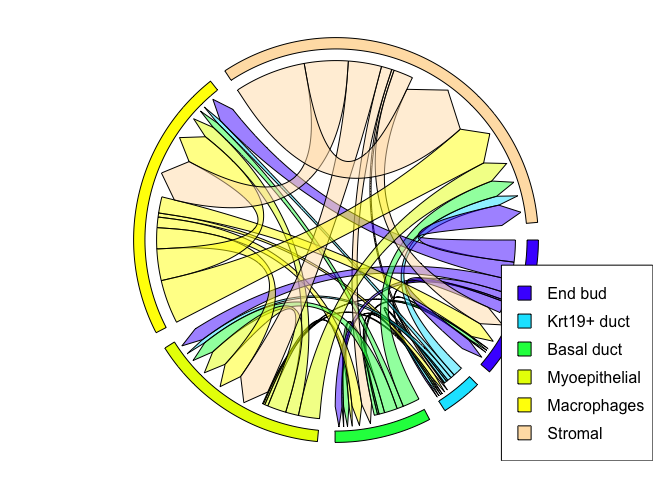

<!-- README.md is generated from README.Rmd. Please edit that file -->
# LigandReceptor

<!-- badges: start -->
<!-- badges: end -->
The goal of LigandReceptor is to simplify the process of identifying potential ligand-receptor pairs in scRNAseq data

## Installation

You can install LigandReceptor from [GitHub](https://github.com/) with:

``` r
# install.packages("devtools")
devtools::install_github("chiblyaa/LigandReceptor")
```

## Example

To use this function, first obtain a list of genes expressed in a scRNAseq dataset using the SEURAT function FindAllMarkers(). An example of an acceptable table:

|         |  p\_val|  avg\_logFC|  pct.1|  pct.2|  p\_val\_adj| cluster | gene    |
|---------|-------:|-----------:|------:|------:|------------:|:--------|:--------|
| Gpx2    |       0|   1.4570746|  0.858|  0.069|            0| End bud | Gpx2    |
| Aldoc   |       0|   1.1354879|  0.750|  0.091|            0| End bud | Aldoc   |
| Tmem54  |       0|   0.4738690|  0.549|  0.038|            0| End bud | Tmem54  |
| S100a14 |       0|   0.3989609|  0.424|  0.025|            0| End bud | S100a14 |
| Bex4    |       0|   0.9329017|  0.805|  0.125|            0| End bud | Bex4    |

Basic example code for generating a table with ligand-receptor pairs:

``` r

library(LigandReceptor)
#> 
#> Attaching package: 'LigandReceptor'
#> The following object is masked _by_ '.GlobalEnv':
#> 
#>     test_dataset
## This will generate a table with ligand-receptor pair for the specified cell types in celltypelabels
LR.pairs <- LigandReceptorPairsTable(seuratDEGS = test_dataset, LRdatabase = LRdatabase)
knitr::kable(LR.pairs[1:10,], caption = "Ligand-Receptor pairs: ")
```

| from          | to          |  value| pairs                                                                                                                                                                                                                                                                                                                             |
|:--------------|:------------|------:|:----------------------------------------------------------------------------------------------------------------------------------------------------------------------------------------------------------------------------------------------------------------------------------------------------------------------------------|
| End bud       | End bud     |     14| Tnc\_sdc4, Lamc2\_itgb4, Lamc2\_itga6, Lamc2\_col17a1, Lamc2\_cd151, Lamb3\_col17a1, Lamb3\_cd151, Lamb3\_itga6, Lamb3\_itgb4, Lama5\_itga6, Lama5\_itgb4, Lama5\_bcam, Hbegf\_cd9, Cdh1\_ptprf                                                                                                                                   |
| Krt19+ duct   | End bud     |      1| Cdh1\_ptprf                                                                                                                                                                                                                                                                                                                       |
| Basal duct    | End bud     |      4| Thbs1\_sdc4, Thbs1\_itga6, Hbegf\_cd9, Cdh1\_ptprf                                                                                                                                                                                                                                                                                |
| Myoepithelial | End bud     |      1| Gnai2\_f2r                                                                                                                                                                                                                                                                                                                        |
| Macrophages   | End bud     |     20| Thbs1\_sdc4, Thbs1\_itga6, Tgm2\_sdc4, Mdk\_sdc4, Mdk\_itga6, Lamc2\_itgb4, Lamc2\_itga6, Lamc2\_col17a1, Lamc2\_cd151, Lamc1\_itgb4, Lamc1\_itga6, Lamb3\_col17a1, Lamb3\_cd151, Lamb3\_itga6, Lamb3\_itgb4, Lamb1\_itga6, Lamb1\_itgb4, Lama5\_itga6, Lama5\_itgb4, Lama5\_bcam                                                 |
| Stromal       | End bud     |     24| Tnfsf12\_tnfrsf12a, Thbs2\_itga6, Thbs1\_sdc4, Thbs1\_itga6, Tfpi\_f3, Tfpi\_sdc4, Rspo3\_sdc4, Rspo3\_lgr4, Nid1\_ptprf, Mdk\_sdc4, Mdk\_itga6, Lamc1\_itgb4, Lamc1\_itga6, Lamb1\_itga6, Lamb1\_itgb4, Lama4\_itga6, Lama2\_itgb4, Lama2\_itga6, Lama2\_rpsa, Gnai2\_f2r, Fn1\_itga6, Cxcl12\_sdc4, Col6a1\_itga6, Adam12\_sdc4 |
| End bud       | Krt19+ duct |      2| Hbegf\_cd9, Cdh1\_ptprf                                                                                                                                                                                                                                                                                                           |
| Krt19+ duct   | Krt19+ duct |      3| Cdh1\_ptprf, Calm1\_hmmr, Calm1\_kcnn4                                                                                                                                                                                                                                                                                            |
| Basal duct    | Krt19+ duct |      2| Hbegf\_cd9, Cdh1\_ptprf                                                                                                                                                                                                                                                                                                           |
| Myoepithelial | Krt19+ duct |      2| Calm1\_hmmr, Calm1\_kcnn4                                                                                                                                                                                                                                                                                                         |

Chord plot to represent ligands from Myoepithelial cells to all other cells:

``` r
# This will generate the chord plot associated with the table
colors = topo.colors(as.numeric(length(unique(test_dataset$cluster)))) # create vector of colors of length = ncells
names(colors) <- as.character(unique(test_dataset$cluster))

PairsPlot(cellcolors=colors, seuratDEGS = test_dataset, LRdatabase)
legend("bottomright",   # location of legend
      legend = names(colors), # categories or elements to render in
             # the legend
      fill = colors) 
```


