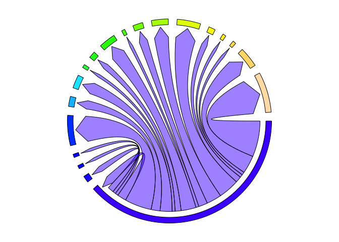

<!-- README.md is generated from README.Rmd. Please edit that file -->
# LigandReceptor

<!-- badges: start -->
<!-- badges: end -->
The goal of LigandReceptor is to simplify the process of identifying potential ligand-receptor pairs in scRNAseq data

## Installation

You can install LigandReceptor from [GitHub](https://github.com/) with:

``` r
# install.packages("devtools")
devtools::install_github("chiblyaa/LigandReceptor")
```

## Example

To use this function, first obtain a list of genes expressed in a scRNAseq dataset using the SEURAT function FindAllMarkers():

``` r
## basic example code
library(Seurat)
library(LigandReceptor)

seuratDEGS <- LigandReceptor::test_dataset #test_dataset obtained using FindAllMarkers from SEURAT
ncells = 23 #number of unique cell identities in SEURAT object
celltypelabels = as.vector(unique(test_dataset$cluster)) # create vector of cell identities
colors = topo.colors(ncells) # create vector of colors of length = ncells
LRdatabase <- LigandReceptor::LRdatabase # Load ligand-receptor pair reference database

## This will generate a table with ligand-receptor pair for the specified cell types in celltypelabels
LR.pairs <- LigandReceptorPairsTable(ncells, celltypelabels, seuratDEGS, LRdatabase)

# This will generate the chord plot associated with the table
PairsPlot("filename.pdf", ncells, celltypelabels, cellcolors=colors, seuratDEGS, LRdatabase, from = "Myoepithelial")
```



The generated table looks like this:

``` r
head(LR.pairs[LR.pairs$from %in% "Myoepithelial", ])
#>              from                to value
#> 4   Myoepithelial           End bud     2
#> 27  Myoepithelial       Krt19+ duct     1
#> 50  Myoepithelial        Basal duct     1
#> 73  Myoepithelial     Myoepithelial     3
#> 96  Myoepithelial Bpifa2+ Proacinar     9
#> 119 Myoepithelial   Smgc+ Proacinar     0
#>                                                                                                             pairs
#> 4                                                                                      Hsp90b1_asgr1, Calm1_pde1c
#> 27                                                                                                     Cdh1_ptprf
#> 50                                                                                                    Calm1_kcnn4
#> 73                                                                            Cdh1_ptprf, Calm1_hmmr, Calm1_kcnn4
#> 96  Sema3b_nrp2, Sema3b_nrp1, Mllt4_f11r, Hras_cav1, Hmgb1_thbd, Cdh1_ptprm, Calr_scarf1, Calm1_abca1, Anxa1_dysf
#> 119
```
